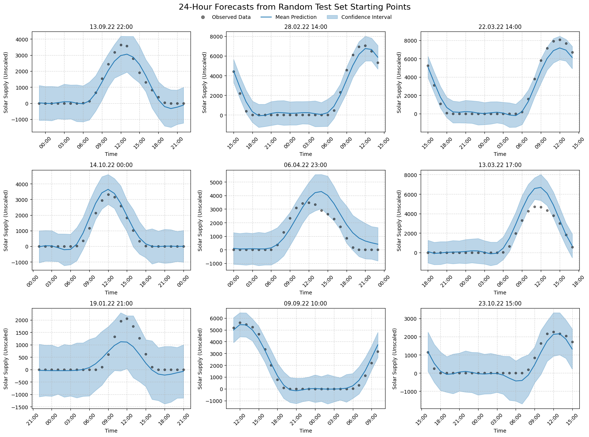

# Solar Power Forecasting Using Gaussian Processes

---
### The task:
- Use a GP to predict solar energy generation based on historical solar power and weather data. At each time point, predict the hourly output for the  next day.
- Analyze the forecast errors for the different forecast horizons using the RMSE and CRPS. 
- Use the last available year of data as your test set.

- Predict the column "Solar_Power" from the file: "Realised_Supply_Germany"

- Bonus Task: Test different feature selection approaches for the weather input.
---
I'll use GPyTorch, as it uses PyTorch under the hood, it's quite large, I can choose a lot of distributions, I can evaluate models and the predictive distributions, and supports approximate GPs. Scikit-learn on the other hand only supports exact inerence, which scales with $\mathcal{O}(n^3)$, making it infeasible for this project. 

--- 
At the end, we'll have to hold a presentation where roughly half of the time is used for data preparation and the model and the other half is used for the plots. 
It will be structured into:
- Data preparation
- Rough, intuitive explanation of the model (approximate GP)
- What do I have to consider and think about so that the model fits onto my task?
- Plots and conclusion with model strenghts and weaknesses